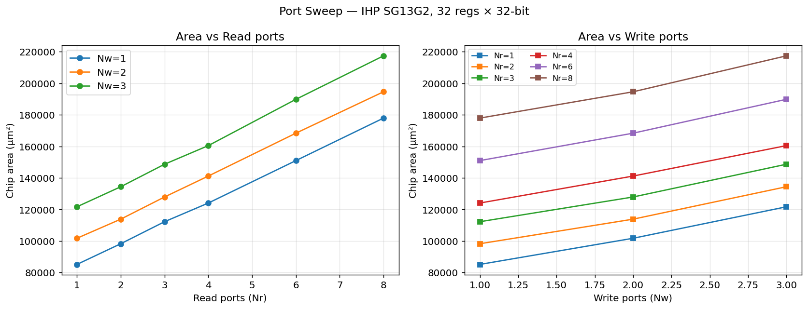
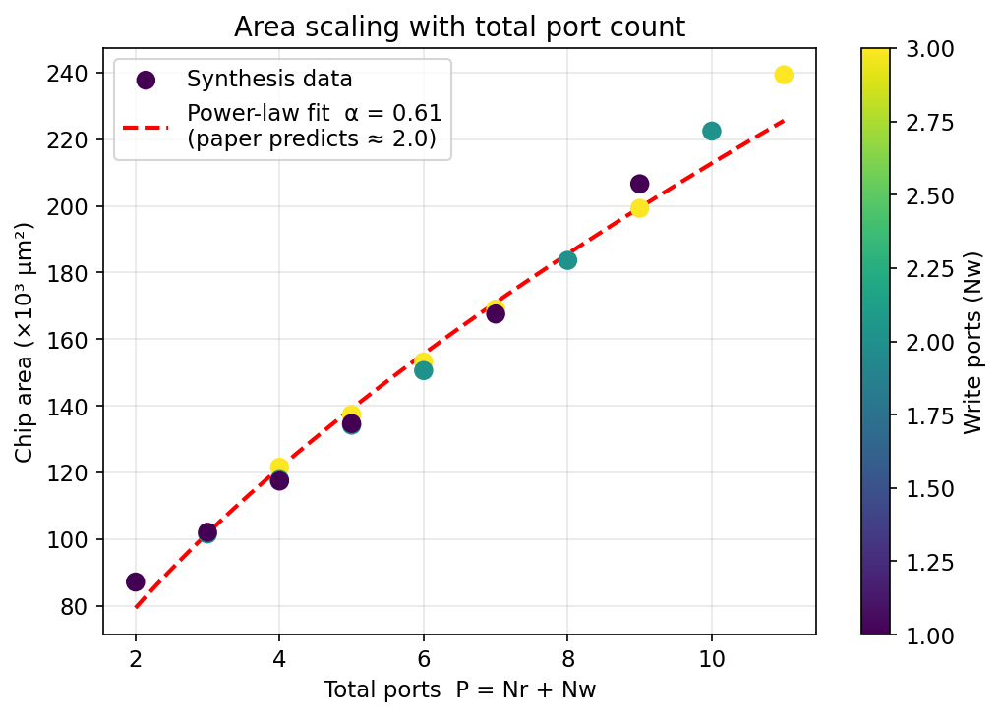
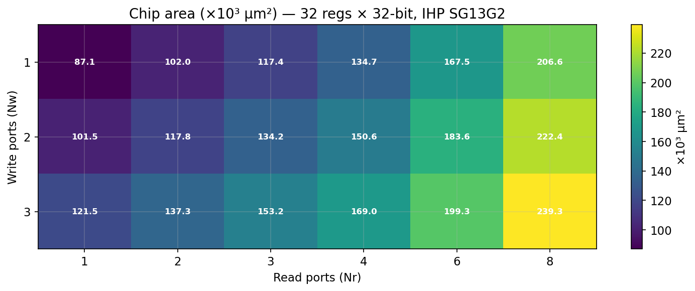
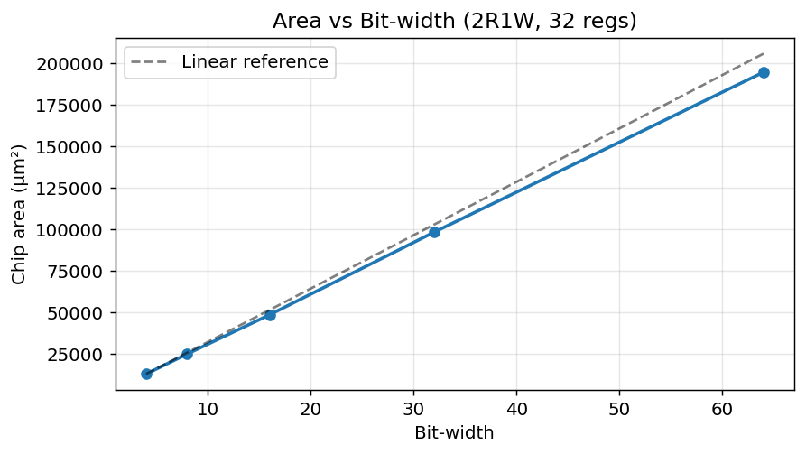
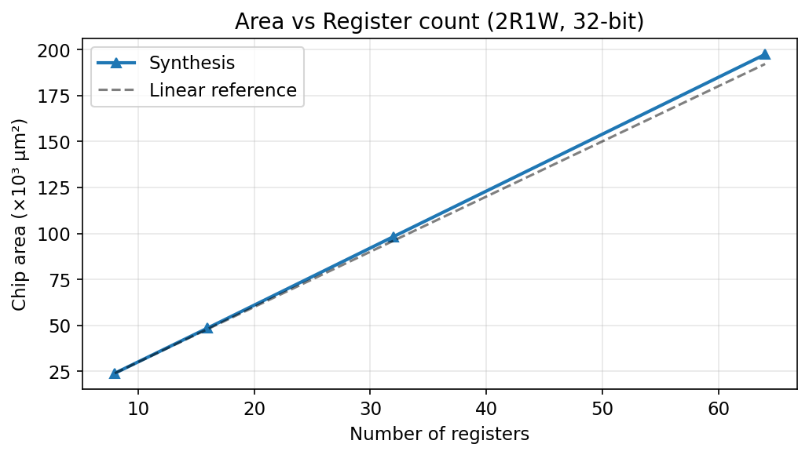
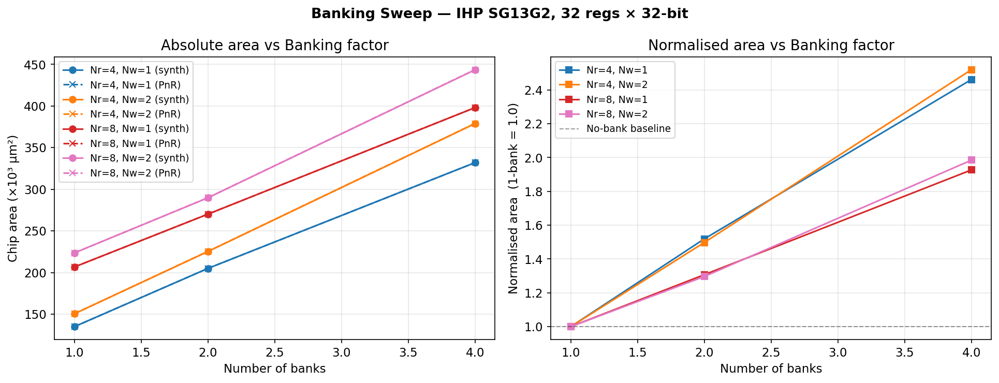

# regfile_minmax

Investigating the area-scaling behaviour of parameterizable register files synthesised with **Yosys** and placed with **OpenROAD** targeting the **IHP SG13G2 130 nm** open-source standard-cell PDK.

Analyzes RegFile scaling behavior similar to:

> Zyuban V., Kogge P. (1998). *The Energy Complexity of Register Files.*
> Proceedings of the 1998 International Symposium on Low Power Electronics and Design (**ISLPED '98**).
> DOI [10.1145/280756.280943](https://dl.acm.org/doi/10.1145/280756.280943)

> [!note]
> The above paper actually cites another paper about the quadratic area scaling, but that paper merely mentions it in passing. The above actually has better results (though it only has access energy graphs).

The paper characterises register-file area and power as scaling roughly as O(N·P²) where N is the register count and P = Nᵣ + N_w is the total port count.

We check whether this prediction matches modern PDKs.

---

## Conclusion

Standard assumptions always say regfiles scale quadratically with respect to number of ports.
However, this only applies to __SRAM-based RegFiles__. The quadratic scaling refers to the bitcell design.
For "liquid" synthesized regfiles where your memory isn't an SRAM macro, the scaling behavior is actually 

$$Area \approx O(N \cdot \sqrt{P})$$

(Note: likely closer to a log2(P) + P if you think about it, but for "sensible" numbers of ports sqrt might be good enough) 

---

## Synthesis vs PnR area

The flow now collects **two** area estimates for every configuration:

| Source | What it measures | Column in `summary.csv` |
|---|---|---|
| **Yosys `stat -liberty`** | Sum of liberty cell areas (no placement, no routing) | `chip_area_um2` |
| **OpenROAD global placement** | Total std-cell area after floorplanning, pin placement, buffer insertion, and global placement | `pnr_total_area_um2` |

The PnR estimate is more realistic because OpenROAD's `repair_design` may insert buffers and
`global_placement` accounts for physical density constraints.  The report also provides
`pnr_die_area_um2`, `pnr_core_area_um2`, `pnr_active_area_um2`, and `pnr_core_utilization`.

---

## Key findings

| Metric | Paper (custom VLSI) | This work (std-cell, Yosys + IHP SG13G2) |
|---|---|---|
| Area ~ P^α  (port scaling) | α ≈ 2.0 | **α ≈ 0.55** |
| Area vs bit-width | Linear | Linear ✓ |
| Area vs register count | Linear–super-linear | Near-linear ✓ |
| Banking reduces area? | Yes (at high port counts) | Yes ✓ |

Standard-cell synthesis is **sub-quadratic** in port count because read ports map to independent mux trees that share the same FF array — unlike custom bitcell arrays where every extra port adds physical bit-line routing.
Write ports are consistently more expensive per port than read ports in both the paper and this work.

---

## Results

### Port sweep (32 regs × 32-bit, IHP SG13G2)

Area as a function of read-port count (coloured by write-port count) and write-port count (coloured by read-port count):



### Area scaling — power-law fit

Log-log fit across all (Nᵣ, N_w) combinations. The fitted exponent α is shown against the paper's prediction of ≈ 2.0:



### Area heatmap

Chip area (×10³ µm²) for every (Nᵣ, N_w) combination at 32 regs × 32-bit:



### Bit-width sweep (2R1W, 32 regs)

Area scales linearly with bit-width, matching the paper's prediction:



### Register count sweep (2R1W, 32-bit)

Area is near-linear in register count (slight super-linearity from deeper address muxes):



### Banking sweep (32 regs × 32-bit)

Read-port banking: each bank stores all registers but serves only Nᵣ / NUM_BANKS read ports.
Higher port counts see a greater benefit from banking (right panel: normalised to 1-bank baseline):



---

## Project structure

```
regfile_minmax/
├── Dockerfile               # iic_osic_tools + vim_deploy (nvim + verible LS) + conda env
├── docker-compose.yml       # Two services: interactive shell & JupyterLab on :8888
├── environment.yml          # Conda packages: pandas, plotly, matplotlib, jupyter, …
├── rtl/
│   ├── regfile.sv           # Flat multi-port register file (synthesisable SV)
│   └── regfile_banked.sv    # Banked variant (NUM_BANKS sub-files, write broadcast)
├── flow/
│   ├── synth.tcl            # Yosys -c Tcl script: elaborate → map → stat report
│   ├── run_sweep.py         # Parameter sweep runner (synth + PnR); caches finished runs
│   ├── parse_reports.py     # Yosys stat + OpenROAD placement report parser
│   ├── generate_plots.py    # Headless matplotlib PNG generator
│   ├── smoke_test.sh        # Quick single-config synthesis + PnR sanity check
│   └── pnr/
│       ├── estimate_placement_area.tcl  # Parameterized OpenROAD global-placement script
│       ├── init_tech.tcl                # PDK / liberty / LEF initialisation
│       ├── constraints.sdc              # Clock & boundary constraints
│       ├── power_connect.tcl            # Power-net global connections
│       ├── reports.tcl                  # OpenROAD report_metrics helper
│       └── reports_area.tcl             # Hierarchical area report
├── notebooks/
│   └── analysis.ipynb       # Interactive Plotly + matplotlib analysis notebook
└── results/
    ├── summary.csv          # All synthesis results (one row per config)
    └── *.png                # Generated plots
```

---

## Quick start

### 1 · Build and enter the container

```bash
docker compose run regfile-study
```

### 2 · Run the full analysis flow (synthesis + PnR, recommended)

```bash
make plot
```

To run only synthesis (no OpenROAD PnR):

```bash
make sweep-synth-only
```

### 3 · Interactive Plotly notebook

From **outside** the container (or a second terminal):

```bash
docker compose up jupyter
# open http://localhost:8888 → notebooks/analysis.ipynb
```

### Smoke test (single synthesis + PnR)

```bash
make smoke
```

### Python-based calls

For custom debugging or ad-hoc runs, the Python scripts can still be used
directly:

```bash
# All sweeps (synthesis + PnR)
python flow/run_sweep.py --sweep all

# Single sweep
python flow/run_sweep.py --sweep port

# Synthesis only (skip PnR placement estimate)
python flow/run_sweep.py --sweep all --skip-pnr

# Regenerate plots from summary.csv
python flow/generate_plots.py
```

---

## RTL parameters

### `regfile` (flat)

| Parameter | Default | Description |
|---|---|---|
| `NUM_RD_PORTS` | 2 | Simultaneous read ports (async) |
| `NUM_WR_PORTS` | 1 | Simultaneous write ports (sync) |
| `BITWIDTH` | 32 | Register width in bits |
| `NUM_REGS` | 32 | Number of registers |

### `regfile_banked`

All parameters of `regfile`, plus:

| Parameter | Default | Description |
|---|---|---|
| `NUM_BANKS` | 2 | Number of banks (`NUM_RD_PORTS` must be divisible by `NUM_BANKS`) |

Banking strategy: each bank is a full copy of `regfile` with `NUM_RD_PORTS/NUM_BANKS` read ports.
All write ports are broadcast to every bank. The trade-off is ×`NUM_BANKS` FF area against smaller per-bank mux trees.

---

## Synthesis flow

```
read_verilog -sv rtl/regfile.sv
chparam  (per-run overrides)
hierarchy → proc → flatten → opt → memory → techmap → dfflibmap → abc → opt_clean
stat -liberty  →  results/<run_id>/stat.rpt
```

Target liberty: `$PDK_ROOT/ihp-sg13g2/libs.ref/sg13g2_stdcell/lib/sg13g2_stdcell_typ_1p20V_25C.lib`
(1.2 V, 25 °C typical corner, included in [iic-osic-tools](https://github.com/iic-jku/iic-osic-tools))

## PnR placement flow

After synthesis, each netlist is run through **OpenROAD** for a global-placement area estimate:

```
read_verilog results/<run_id>/netlist.v
link_design  <top>
initialize_floorplan → make_tracks → place_pins
repair_design        (buffer insertion)
global_placement     (density = 0.60)
report_metrics       →  results/<run_id>/gpl-pnr.rpt
```

The PnR report contains die/core/total/active area and core utilization.
Use `--skip-pnr` to skip this step if only synthesis area is needed.

---

## Environment

Built on top of **[hpretl/iic-osic-tools](https://github.com/iic-jku/iic-osic-tools)** with [vim_deploy](https://github.com/Lawrence-lugs/vim_deploy) customisations (Neovim + Verible language server + Miniforge).

| Tool | Version |
|---|---|
| Yosys | 0.60 |
| IHP SG13G2 PDK | via iic-osic-tools |
| Python | 3.14 (Miniforge base) |
| Neovim + Verible LS | via vim_deploy |
